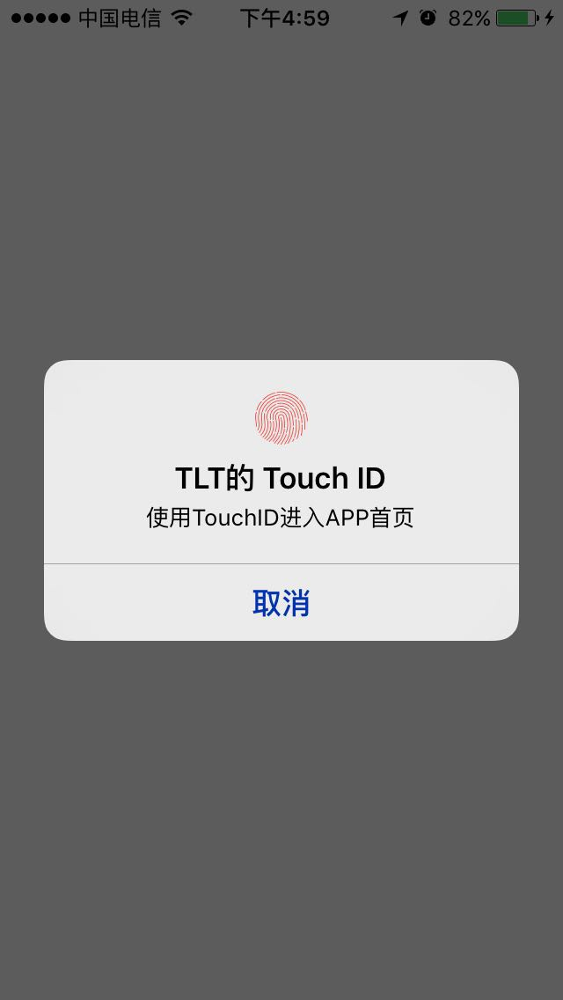

# TouchID登陆

## [KeyChain and TouchID Demo](https://github.com/JyHu/TouchIDAndKeyChain.git)



首先需要引入一个库`#import <LocalAuthentication/LAContext.h>`，官方的一个用于TouchID安全验证登陆的`Framework`，首先需要验证是否支持TouchID登陆：

```Objective-C
// 判断是否支持TouchID登陆
- (BOOL)canEvaluatePolicy
{
    LAContext *context = [[LAContext alloc] init];
    NSError *error;
    return [context canEvaluatePolicy:LAPolicyDeviceOwnerAuthentication error:&error];
}
```

如果不支持的话，就需要走自己APP中得密码验证方法来进行验证登陆；
如果支持的话，就调起TouchID验证的页面：

```Objective-C
- (void)evaluatePolicy
{
    LAContext *context = [[LAContext alloc] init];
    [context evaluatePolicy:LAPolicyDeviceOwnerAuthenticationWithBiometrics localizedReason:@"使用TouchID进入APP首页" reply:^(BOOL success, NSError * _Nullable error) {
        dispatch_async(dispatch_get_main_queue(), ^{
            if (success) {
                // ...
            }
            else {
                // ...
            }
        });
    }];
}
```

## 注意

> `reply`这个block中得代码是在异步线程中执行的，如果有需要的话，必须得抛到主线程中去执行一些东西。
> 
> TouchID的失败次数是有限制的，从开始算，如果失败了三次，系统就会自动的退出TouchID的验证界面，并在`reply`block中返回失败的信息，这时还可以调起TouchID的验证，此时如果失败两次即会退出验证界面。
> 在这种情况下，如果还想用TouchID验证，则必须输入手机的登陆密码才能继续验证。
> 需要注意的是，这个失败的次数在iOS设备中所有的APP是累加起来的。
>


# `KeyChain`

`keychain`是作为苹果中对于数据安全存储的一个地方，类似于`NSUserDefaults`，但又不同于`NSUserDefaults`。

对于`keychain`来说，需要注意的方法有以下四个：
* `SecItemAdd`
* `SecItemUpdate`
* `SecItemCopyMatching`
* `SecItemDelete`

## 注意

> 在使用的时候**一定**要注意`KeyChain`操作的返回值。

`KeyChain`操作中得一些参数的设定([一些相关参数的说明](https://github.com/JyHu/MDDocuments/blob/master/2016/03/KeyChainParameters.md))：

```
- (NSMutableDictionary *)getKeychainQueryWithService:(NSString *)service
{
    NSMutableDictionary *query = [NSMutableDictionary dictionaryWithObjectsAndKeys:
                (__bridge id)kSecClassGenericPassword, (__bridge id)kSecClass,
                service, (__bridge id)kSecAttrService,
                service, (__bridge id)kSecAttrAccount,
                (__bridge id)kSecAttrAccessibleAfterFirstUnlock, (__bridge id)kSecAttrAccessible,
            nil];
    if (self.accessGroupName != nil) {
        [query setObject:self.accessGroupName forKey:(__bridge id)kSecAttrAccessGroup];
    }
    return query;
}
```

## `SecItemAdd`

用于将个人数据条目保存到`keychain`中。
- 方法原型：`OSStatus SecItemAdd(CFDictionaryRef attributes, CFTypeRef * result);`
    - `attributes` : 添加属性的设置。
    - `result` : 可以用与获取返回值，`&res`

```
- (OSStatus)saveObject:(id)object forService:(NSString *)service {
    NSMutableDictionary *keychainQuery = [self getKeychainQueryWithService:service];
    // 需要检查数据的存在性，如果存在的话，就用SecItemUpdate更新，否则就添加
    [keychainQuery setObject:[NSKeyedArchiver archivedDataWithRootObject:object] forKey:(__bridge id)kSecValueData];
    return SecItemAdd((__bridge CFDictionaryRef)keychainQuery, NULL);
}
```

## `SecItemUpdate`

用于更新`KeyChain`中保存的数据。
- 方法原型：`OSStatus SecItemUpdate(CFDictionaryRef query, CFDictionaryRef attributesToUpdate);`
    - `query` : 查找属性的设置
    - `attributesToUpdate` : 要更新的数据

```Objective-C
- (OSStatus)updateService:(NSString *)service withObject:(id)object
{
    NSDictionary *keychainQuery = [self getKeychainQueryWithService:service];
    NSDictionary *changes = @{
                              (__bridge id)kSecValueData : [NSKeyedArchiver archivedDataWithRootObject:object]
                              };
    return SecItemUpdate((__bridge CFDictionaryRef)keychainQuery, (__bridge CFDictionaryRef)changes);
}
```

## `SecItemCopyMatching`

用于获取保存在`KeyChain`中得数据。
- 方法原型：`OSStatus SecItemCopyMatching(CFDictionaryRef query, CFTypeRef * result);`
    - `query` : 保存在`KeyChain`中得数据信息。
    - `result` : 从`KeyChain`中取得的数据。

```Objective-C
- (id)loadObjectForService:(NSString *)service {
    NSMutableDictionary *keychainQuery = [self getKeychainQueryWithService:service];
    [keychainQuery setObject:(__bridge id)kCFBooleanTrue forKey:(__bridge id)kSecReturnData];
    [keychainQuery setObject:(__bridge id)kSecMatchLimitAll forKey:(__bridge id)kSecMatchLimit];
    CFDataRef dataRef = NULL;
    OSStatus status = SecItemCopyMatching((__bridge CFDictionaryRef)keychainQuery, (CFTypeRef *)&dataRef);
    id results = nil;
    if (status == errSecSuccess) {
        @try {
            results = [NSKeyedUnarchiver unarchiveObjectWithData:(__bridge NSData *)dataRef];
        }
        @catch (NSException *exception) {
            NSLog(@"%@", exception);
        }
        @finally {
            NSLog(@"finally");
        }
    } 
    if (dataRef) {
        CFRelease(dataRef);
    }
    return results;
}
```

## `SecItemDelete`

用于删除保存在`KeyChain`中得数据。
- 方法原型:`OSStatus SecItemDelete(CFDictionaryRef query)`
    - `query`:要删除的数据的信息。

```
- (void)delete:(NSString *)service {
    NSMutableDictionary *keychainQuery = [self getKeychainQueryWithService:service];
    SecItemDelete((__bridge CFDictionaryRef)keychainQuery);
}
```

# 附:

## `OSStatus`状态码

```
CF_ENUM(OSStatus)
{
    errSecSuccess                               = 0,       /* No error. */
    errSecUnimplemented                         = -4,      /* Function or operation not implemented. */
    errSecIO                                    = -36,     /*I/O error (bummers)*/
    errSecOpWr                                  = -49,     /*file already open with with write permission*/
    errSecParam                                 = -50,     /* One or more parameters passed to a function where not valid. */
    errSecAllocate                              = -108,    /* Failed to allocate memory. */
    errSecUserCanceled                          = -128,    /* User canceled the operation. */
    errSecBadReq                                = -909,    /* Bad parameter or invalid state for operation. */
    errSecInternalComponent                     = -2070,
    errSecNotAvailable                          = -25291,  /* No keychain is available. You may need to restart your computer. */
    errSecDuplicateItem                         = -25299,  /* The specified item already exists in the keychain. */
    errSecItemNotFound                          = -25300,  /* The specified item could not be found in the keychain. */
    errSecInteractionNotAllowed                 = -25308,  /* User interaction is not allowed. */
    errSecDecode                                = -26275,  /* Unable to decode the provided data. */
    errSecAuthFailed                            = -25293,  /* The user name or passphrase you entered is not correct. */
};
```
